# 2024A-TP03: Fonction et bibliothèques scientifiques

- [TP03:  Fonction et bibliothèques scientifiques](#2024a-tp03-fonction-et-bibliothèques-scientifiques)
    - [Directives particulières](#directives-particulières)
    - [Introduction](#introduction)
    - [Objectifs](#objectifs)
    - [Analyse d'un fichier CSV](#analyse-dun-fichier-csv)
        - [Préparation des données](#préparation-des-données)
            - [1.1 Chargement des données](#10-chargement-des-données)
            - [1.2 Suppression de colonnes non pertinentes](#11-suppression-de-colonnes-non-pertinentes)
            - [1.3 Renommage de colonnes](#13-renommage-de-colonnes)
        - [Calcul des statistiques](#calcul-des-statistiques)
            - [2.1 Calcul des moyennes](#21-calcul-des-moyennes)
            - [2.2 Calcul des medianes](#22-calcul-des-medianes)
            - [2.3 Calcul des ecart-types](#23-calcul-des-ecart-types)
        - [Comparaison des projets IA et Non-IA](#comparaison-des-projets-ia-et-non-ia)
            - [3.1 Filtrage des projets](#31-filtrage-des-projets)
            - [3.2 Calculer les moyennes](#32-calculer-les-moyennes)
        - [Visualisation des données](#visualisation-des-données)
            - [4.1 Le Scatter plot des étoiles vs forks avec distinction IA et non IA](#41-le-scatter-plot-des-étoiles-vs-forks-avec-distinction-ia-et-non-ia)
            - [4.2 Diagramme en barres comparatif](#42-diagramme-en-barres-comparatif)
        - [Questions](#questions)
        - [Partie Bonus](#partie-bonus)
    - [Remise](#remise)
    - [Barème](#barème)
    - [Annexe: Guide et normes de codage](#annexe-guide-et-normes-de-codage)

:alarm_clock: Date de remise le Dimanche 03 Novembre 23h59

## Directives particulières
- Un fichier TP3.ipynb sera utilisé;
- Pour faire le TP3 vous aurez besion de jupyter notebook (pip install jupyter). Pour ceux qui utilise pycharm vous aurez besoin de la version pro. Si vous ne l'avez pas l'utilisation du navigateur sera suffisante aussi. Pour ceux avec visual studio code, la version gratuite offre déjà le plugin jupyter que vous pouvez installer gratuitement.
- Respecter le [guide de codage](https://github.com/INF1007-Gabarits/Guide-codage-python) et les normes pep8;
- Dans chaque programme, vous pouvez ajouter d’autres fonctions à celles décrites dans l’énoncé pour améliorer la lisibilité.
- N'oubliez pas également d'installer les librairies manquantes (pandas, matplotlib, seaborn, plotly)
- Pas de librairies externes autres que celles déjà importées.

## Introduction

Le TP3 porte sur l'utilisation de fonctions et de bibliothèques scientifiques en Python. Vous serez amené(e) à découvrir pandas, une bibliothèque incontournable en python lorsqu'il s'agit de l'analyse de fichier, et à visualiser des données à l'aide de matplotlib et seaborn.
Dans le cadre de ce TP, vous jouez le rôle d'un(e) chercheur/chercheuse dans un laboratoire de recherche de Polytechnique Montreal en génie informatique et logiciel. Votre premier projet consiste à mener une étude sur la popularité des projets open-source. L'objectif est de déterminer si les projets liés au machine learning sont plus populaires que les autres.

## Objectifs
- Charger, explorer et filtrer un ensemble de données contenant des informations.
- Représenter graphiquement des distributions afin des les comparer.
- Utiliser des fonctions pour structurer votre code et automatiser la comparaison entre différentes distributions.
- Analyser les visualisations obtenues pour en tirer des conclusions.

## Analyse d'un fichier CSV 🔎
L'objectif de ce projet est d'explorer et d'analyser un fichier CSV contenant des informations sur différents projets GitHub. Ce fichier inclut le nombre d'étoiles, de forks, ainsi que la classification des projets selon l'utilisation de l'intelligence artificielle (IA). L'analyse se déroule en plusieurs étapes : préparation des données, calcul des statistiques, comparaison des projets, visualisation des résultats et enfin, réponse à quelques questions basées sur les résultats obtenus.

### Préparation des données
Avant de procéder à l'analyse des données, vous allez d'abord nettoyer et préparer le jeu de données pour le rendre exploitable.

#### 1.1 Chargement des données
La première étape consiste à charger les données du fichier CSV dans un **DataFrame Pandas**. Ce DataFrame facilitera la manipulation des données pour les étapes suivantes. Votre tâche consiste à utiliser la bibliothèque Pandas pour récupérer ces données en complétant la fonction `charger_donnees()`. Pour charger un fichier CSV avec Pandas, vous utiliserez la fonction [`read_csv`](https://pandas.pydata.org/docs/reference/api/pandas.read_csv.html)

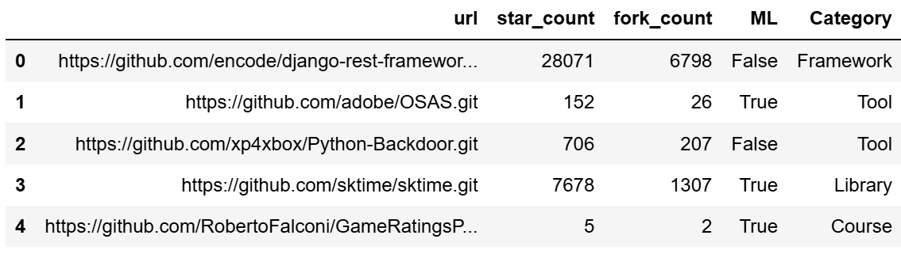

#### 1.2 Suppression de colonnes non pertinentes
Certaines colonnes peuvent ne pas être nécessaires pour l'analyse. Il est donc utile de les supprimer pour simplifier le jeu de données. Dans notre cas, la colonne **Category** n'est pas indispensable. Votre tâche dans cette partie est de compléter la fonction `supprimer_colonne()` et de l'utiliser pour supprimer cette colonne. Pour supprimer une colonne avec Pandas, vous utiliserez la fonction [`drop`](https://pandas.pydata.org/pandas-docs/stable/reference/api/pandas.DataFrame.drop.html)

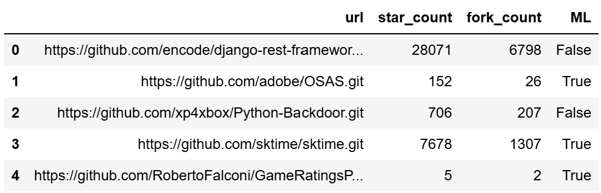

#### 1.2 Renommage de colonnes
Dans cette partie, vous allez renommer certaines colonnes pour leur donner des noms plus explicites et plus faciles à manipuler. Plus précisément, votre tâche est de renommer les colonnes **star_count** et **fork_count** en **stars** et **forks** respectivement, en complétant la fonction `renommer_colonne()` et en effectuant les appels nécessaires. Pour renommer une colonne avec Pandas, vous utiliserez la fonction [`rename`](https://pandas.pydata.org/pandas-docs/stable/reference/api/pandas.DataFrame.rename.html)
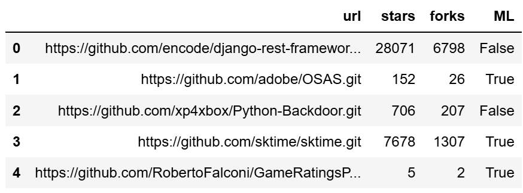

### Calcul des statistiques
Une fois les données prêtes, nous passons aux calculs statistiques pour extraire des informations clés sur les projets GitHub, telles que les moyennes, les médianes et les écarts-types.

#### 2.1 Calcul des moyennes
Dans cette partie, nous voulons avoir une estimation générale des projets en termes d'étoiles et de forks. Pour ce faire, vous allez compléter la fonction `calculer_moyenne()` et  calculer la moyenne des **étoiles** et des **forks** pour l'ensemble des projets afin d'obtenir une vue d'ensemble de la popularité moyenne des projets. Pour calculer la moyenne avec Pandas, vous utiliserez la fonction [`mean`](https://pandas.pydata.org/pandas-docs/stable/reference/api/pandas.DataFrame.mean.html)

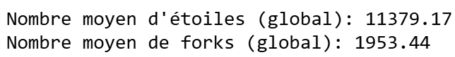

#### 2.2 Calcul des medianes
Calculer la médiane des **étoiles** et des **forks** pour l'ensemble des projets, ce qui permet de comprendre la distribution des valeurs en complétant la fonction `calculer_mediane()` et en faisant les appels appropriés. Pour calculer la mediane avec Pandas, vous utiliserez la fonction [`median`](https://pandas.pydata.org/pandas-docs/stable/reference/api/pandas.DataFrame.median.html)

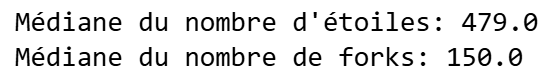

#### 2.3 Calcul des écart-types
Calculer les écart-types des **étoiles** et des **forks** pour l'ensemble des projets, ce qui permet de comprendre la distribution des valeurs en complétant la fonction `calculer_ecart_type()` et en faisant les appels appropriés. Pour calculer l'écart-type avec Pandas, vous utiliserez la fonction [`std`](https://pandas.pydata.org/pandas-docs/stable/reference/api/pandas.DataFrame.std.html)

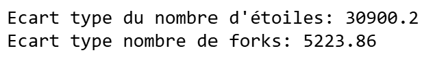

### Comparaison des projets IA et Non-IA
Cette section se concentre sur la comparaison des projets utilisant l'intelligence artificielle (IA) avec ceux qui n'en utilisent pas. L'objectif est de voir si les projets IA sont globalement plus populaires que les autres.

#### 3.1 Filtrage des projets
Pour pouvoir comparer les projets IA et non IA de manière distincte. Votre tâche dans cette partie sera de séparer les projets en deux groupes: ceux qui utilisent l'IA et ceux qui n'utilisent pas l'IA. Cela permettra de comparer les deux groupes. Vous allez accomplir cette tâche en complétant la fonction `filtrer_dataframe()` et en faisant les appels appropriés pour faire la séparation.

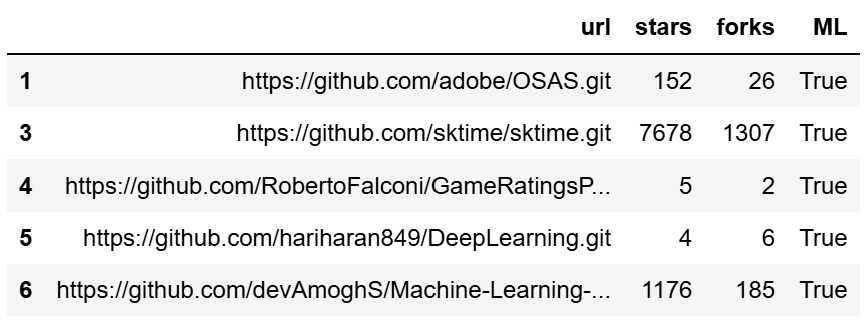

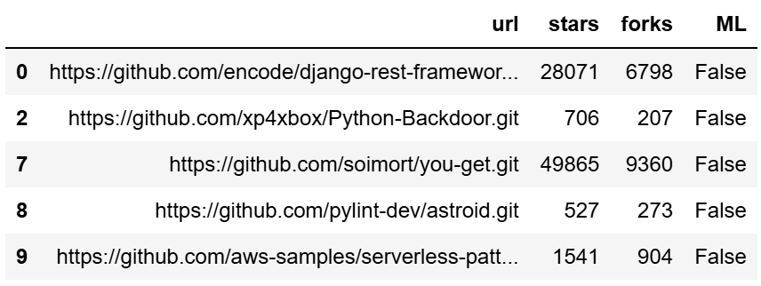

#### 3.2 Calculer les moyennes
Afin d'évaluer s'il y a une différence notable en termes de popularité entre les projets IA et non IA. Vous allez calculer les moyennes des étoiles et des forks pour les projets IA et non IA séparément afin de voir lequel des deux groupes est le plus populaire.

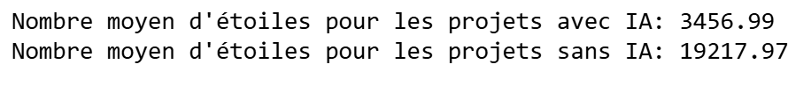

### Visualisation des données
Les graphiques facilitent l’interprétation des données et permettent de mieux comprendre les relations entre les différentes variables. Nous allons créer deux types de visualisations pour explorer la distribution des étoiles et des forks. Dans cette partie vous aurez besoin de combiner la librairie [matplotlib](https://matplotlib.org/stable/tutorials/pyplot.html) et les fonctions [`seaborn.scatterplot`](https://seaborn.pydata.org/generated/seaborn.barplot.html) et [`seaborn.barplot`](https://seaborn.pydata.org/generated/seaborn.scatterplot.html) pour faire vos affichages.

#### 4.1 Le Scatter plot des étoiles vs forks avec distinction IA et non IA
Vous allez visualiser la distribution des projets selon leur popularité (**étoiles** vs **forks**) et voir s'il y a des tendances selon l'utilisation de l'IA. Pour ce faire, créer un graphique en dispersion (scatter plot) qui montre la relation entre le nombre d'**étoiles** et de **forks** pour chaque projet, en distinguant les projets IA des autres. Chaque point représente un projet, et la couleur indique s'il utilise l'IA ou non.

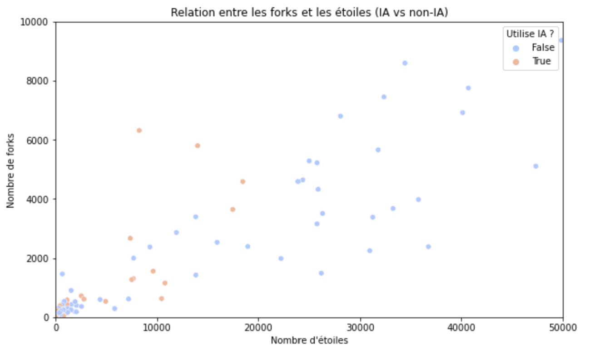

#### 4.2 Diagramme en barres comparatif
Vous allez également créer un diagramme en barres pour comparer la moyenne des **étoiles** et des **forks** entre les projets IA et non IA. Cela permettra de visualiser facilement les différences de popularité entre ces deux groupes.

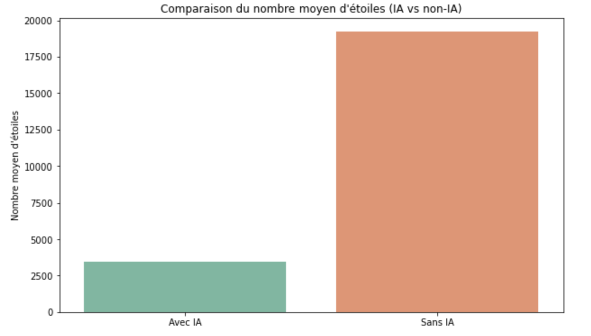

### Questions
Après avoir réalisé l'analyse et les visualisations, des questions vous sont posées pour  vous inciter à réfléchir sur les résultats obtenus et pas juste rouler du code. Ces questions vous encourageront à tirer des conclusions et à interpréter les données de manière plus approfondie.

### Partie Bonus
Vous soumettez votre travail à votre superviseur pour obtenir son retour. Bien qu'il salue la qualité de votre travail, il exprime une certaine insatisfaction. Il vous demande alors de réaliser une étude de corrélation entre **le nombre d'étoiles** et **le nombre de forks** afin d'examiner comment ces deux mesures évoluent ensemble.

Dans cette partie bonus, contrairement aux sections précédentes, aucun indice ne vous sera fourni pour atteindre cet objectif. Vous devrez donc utiliser les compétences que vous avez développées jusqu'à présent pour accomplir cette tâche. Vous devrez calculer la corrélation entre les deux variables, réaliser un scatter plot avec une droite de régression et tirer une conclusion basée sur vos résultats.

## Remise
Pour soumettre votre travail, assurez-vous d'abord que votre fichier, incluant les solutions et les visualisations, fonctionnent correctement et répondent aux critères des differentes parties. Ensuite, faites un dernier commit de vos changements si nécessaire et faites un push sur votre dépôt GitHub Classroom.

Il est important de vérifier sur GitHub que vos dernières modifications ont bien été mises en ligne. Aucune étape supplémentaire comme la création d'un fichier zip n'est nécessaire ; votre travail sera évalué directement à partir de votre dépôt GitHub Classroom. Veillez simplement à ce que tout soit à jour avant la date limite de remise.

## Barème
| Question     | Points  |
| ------------ | ------- |
| 1.1          | 5       |
| 1.2          | 5       |
| 1.3          | 10      |
| 2.1          | 5       |
| 2.2          | 5       |
| 2.3          | 10      |
| 3.1          | 5       |
| 3.2          | 10      |
| 4.1          | 13      |
| 4.2          | 12      |
| Questions    | 10      |
| Qualité du code | 10
| Bonus        | +10      |
| **Total**    | **100**  |

## Annexe: Guide et normes de codage
- [Le guide maison](https://github.com/INF1007-Gabarits/Guide-codage-python) de normes supplémentaires à respecter
- [Le plugin Pycharm Pylint](https://plugins.jetbrains.com/plugin/11084-pylint) qui analyse votre code et indique certaines erreurs. Vous avertis aussi si vous ne respectez pas certaines de normes de PEP8.
- [Quelques indications en français sur PEP8](https://openclassrooms.com/fr/courses/4425111-perfectionnez-vous-en-python/4464230-assimilez-les-bonnes-pratiques-de-la-pep-8)
- [La documentation PEP8 Officielle](https://www.python.org/dev/peps/pep-0008/)
